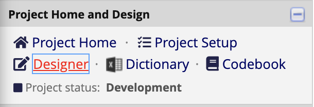
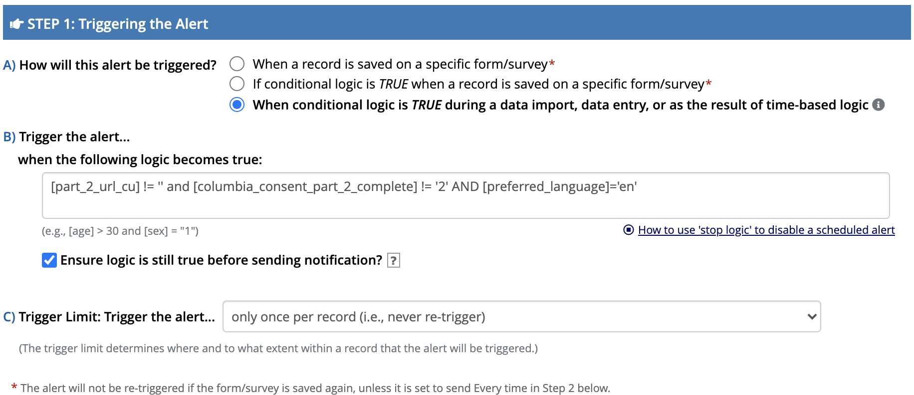
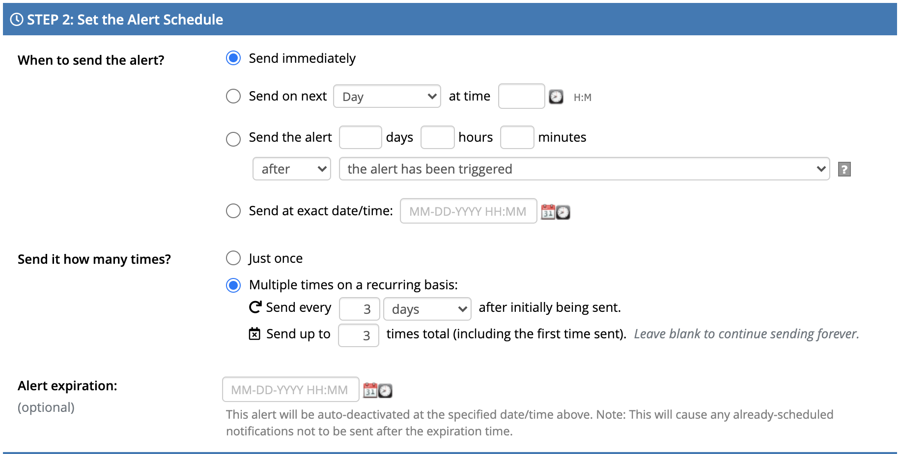
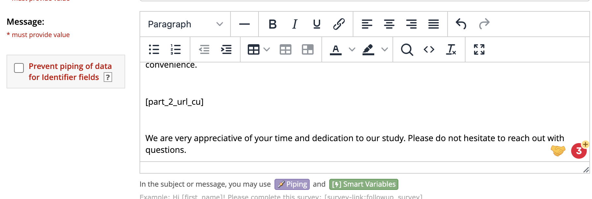

# This is a brief tutorial on how to create alert in local redcap to send automated emails with R4 link to participant.

- Since the local redcap will not act as a survey but rather like a data repo, we will not use the survey notification feature provided by RedCap. 
- We will use **alert** feature in RedCap to achieve this goal.

## An example
- Goal: send automated email reminder to participant and ask them to complete part_2 consent in R4.

### 1. Identify R4 survey URL in the "Designer page" of the local redcap project. 
- Scroll down to the survey, you should find the survey url and return code.
- Feel free to remove the @Hidden Tag. 
- In this case, the URL for the R4 survey we want to notify the participant is `part_2_url_cu`. 
- This is a participant-specific URL 

### 2. Go to "Alert & Notifications" and "Add New Alert"
- The *re-evaluate* button is not for testing purpose.
- To test, make sure all previous alert send events are cleared by executing SQL query [refresh_alert.sql](./refresh_alert.sql) on the backend.
- You can also upload alerts. For example we used can be found [here](./EIVRecruitmentDatabaseClone3_Alerts_2022-03-17.csv)

### 3. Define the logic to trigger the alert. 
- To trigger the alert, we will rely on the R4 logic - send out reminder if there is a survey URL available (i.e `[part_2_url_cu]!=''`), and the survey is not completed yet (i.e. `[columbia_consent_part_2_complete] != '2'`)
- **Note**: Since the records in the local redcap is entered by API data pull, the third radio should be selected for *A) How will this alert be triggered?*

### 4. Define the alert schedule
- **Note**: The alert will only be triggerred once per individual according to the previous setting - meaning the data pull/overwrite won't re-trigger this alert. 
- According to the setting below, the alert will be triggered **once** but scheduled to send out email **3 times** in total.

### 5. Send out message 
- Make sure the R4 url is included in the message using the smart variable provided by RedCap
- In this example, the R4 url for this survey is `part_2_url_cu`

